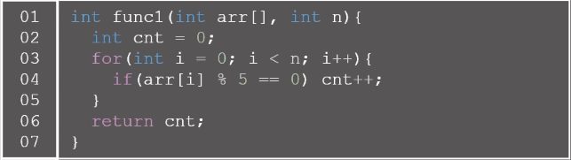
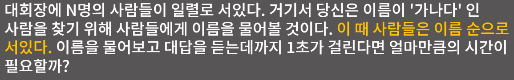
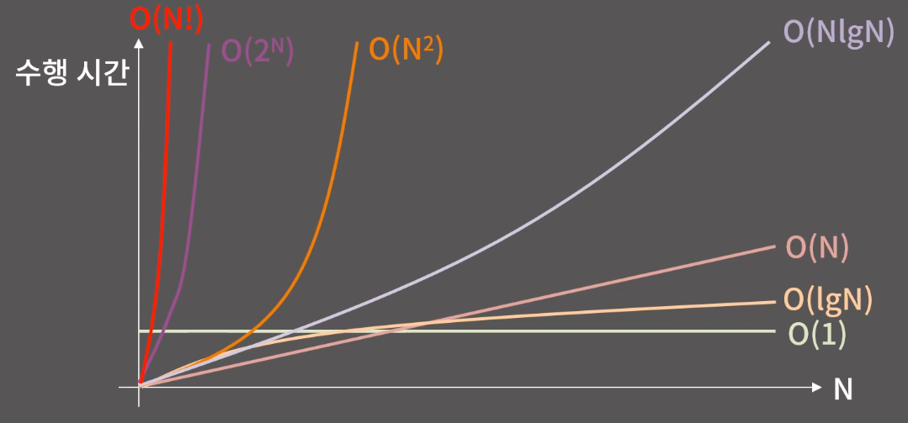

# 시간, 공간 복잡도

## 시간 복잡도

연산의 횟수 : 5n + 3

-> `n`에 비례한다.

**문제**

**정답**
차례대로 물어보면 최악의 경우 N초, 최선의 경우 1초가 걸린다.

평균적으로 걸리는 시간은 `N`에 비례한다.

**문제**

**정답**
중간 사람에게 계속 물어보는 기준으로 최선의 경우 1초, 최악의 경우 `logN`초가 걸린다.

평균적으로 걸리는 시간은 `logN`에 비례하게 된다.

### 개념
- 시간복잡도
  - 입력의 크기와 문제를 해결하는데 걸리는 시간의 상관 관계
- Big-O Notation
  - 주어진 식을 값이 가장 큰 대표항만 남겨서 나타내는 방법
  - O(N): `5N + 3`, `2N + 10lgN`, `10N`

*시간 복잡도 별 N의 크기에 따른 수행 시간 그래프*

*시간 복잡도 별 1초 이내 수행 시간을 위한 N의 크기 비교*

즉, 나의 알고리즘 풀이의 시간 복잡도를 측정할 줄 알아야 하며, 입력값 N의 크기에 따라 알맞은 풀이를 작성했는지 미리 알아야 한다.

## 공간복잡도
입력의 크기와 문제를 해결하는데 필요한 공간의 상관관계
- 512MB = 1.2억개의 int

## 정수 자료형
- short (2 byte)
- int (4 byte)
- long long (8 byte)

### Integer Overflow

컴퓨터는 명령어 대로 연산을 진행하게 된다.
char 자료형 기준으로 127 + 1 = -127이라는 결과를 확인할 수 있다.

## 실수 자료형
- float (4 byte)
- double (8 byte)

### 실수 자료형 특징
- 실수의 저장, 연산 과정에서 반드시 오차가 생길 수 밖에 없다.
- double에 long 범위의 정수를 함부로 담으면 안 된다.
- 실수를 비교할 때는 등호를 사용하면 안 된다.

### *위 문서는 BaaarkingDog 님의 [Youtube](https://www.youtube.com/watch?v=9MMKsrvRiw4&list=PLtqbFd2VIQv4O6D6l9HcD732hdrnYb6CY&index=2) 강의를 참고하였습니다.*
